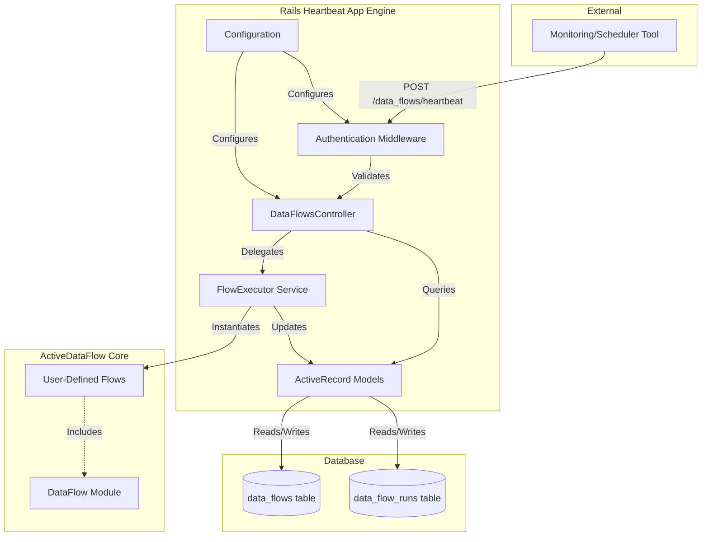
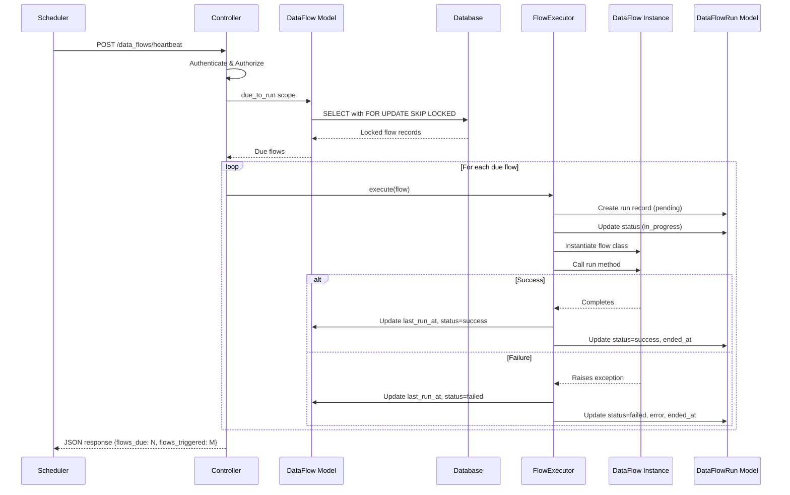

# ActiveDataFlow Rails Heartbeat App - Design Document

## Overview

The Rails Heartbeat App is a Rails Engine that extends the ActiveDataFlow core gem with database-backed, HTTP-triggered execution capabilities. It provides a synchronous execution model where DataFlows are stored as database records and executed within the Rails application process in response to periodic HTTP heartbeat requests.

### Key Design Principles

1. **Database-Driven Configuration**: Flow definitions and state are persisted in the database, enabling runtime management without code deployments
2. **Synchronous Execution**: DataFlows execute in the web process during the heartbeat request, suitable for lightweight operations
3. **Concurrency Safety**: Database-level locking prevents duplicate execution of the same flow
4. **Audit Trail**: Complete execution history with timestamps, status, and error details
5. **Security Layers**: Token-based authentication and IP whitelisting protect the heartbeat endpoint

## Architecture

### Component Diagram



### Execution Flow



## Components and Interfaces

### 1. Database Schema

#### data_flows Table

```ruby
create_table :data_flows do |t|
  t.string :name, null: false, index: { unique: true }
  t.text :description
  t.boolean :enabled, default: true, null: false
  t.text :configuration  # Serialized JSON
  t.integer :run_interval, null: false  # Seconds
  t.datetime :last_run_at
  t.string :last_run_status  # success, failed, null
  t.timestamps
end
```

**Indexes:**
- Unique index on `name`
- Composite index on `(enabled, last_run_at)` for due_to_run queries

#### data_flow_runs Table

```ruby
create_table :data_flow_runs do |t|
  t.references :data_flow, null: false, foreign_key: true, index: true
  t.string :status, null: false  # pending, in_progress, success, failed
  t.datetime :started_at, null: false
  t.datetime :ended_at
  t.text :error_message
  t.text :error_backtrace
  t.timestamps
end
```

**Indexes:**
- Foreign key index on `data_flow_id`
- Composite index on `(data_flow_id, created_at)` for history queries

### 2. ActiveRecord Models

#### DataFlow Model

```ruby
class DataFlow < ApplicationRecord
  # Associations
  has_many :data_flow_runs, dependent: :destroy
  
  # Validations
  validates :name, presence: true, uniqueness: true
  validates :run_interval, numericality: { greater_than: 0 }
  validates :last_run_status, inclusion: { in: %w[success failed], allow_nil: true }
  
  # Serialization
  serialize :configuration, JSON
  
  # Scopes
  scope :enabled, -> { where(enabled: true) }
  scope :due_to_run, -> {
    enabled.where(
      'last_run_at IS NULL OR last_run_at <= ?',
      -> { "NOW() - INTERVAL '1 SECOND' * run_interval" }
    )
  }
  
  # Instance Methods
  def trigger_run!
    # Delegates to FlowExecutor service
  end
  
  def flow_class
    # Constantizes the class name from configuration
  end
end
```

#### DataFlowRun Model

```ruby
class DataFlowRun < ApplicationRecord
  # Associations
  belongs_to :data_flow
  
  # Validations
  validates :status, inclusion: { in: %w[pending in_progress success failed] }
  validates :started_at, presence: true
  
  # Instance Methods
  def duration
    return nil unless ended_at
    ended_at - started_at
  end
  
  def success?
    status == 'success'
  end
  
  def failed?
    status == 'failed'
  end
end
```

### 3. Controller

#### DataFlowsController

```ruby
class DataFlowsController < ApplicationController
  skip_before_action :verify_authenticity_token
  before_action :authenticate_heartbeat!
  before_action :check_ip_whitelist!
  
  def heartbeat
    flows = DataFlow.due_to_run.lock('FOR UPDATE SKIP LOCKED')
    triggered_count = 0
    
    flows.each do |flow|
      FlowExecutor.execute(flow)
      triggered_count += 1
    rescue => e
      Rails.logger.error("Flow execution failed: #{e.message}")
      # Continue with next flow
    end
    
    render json: {
      flows_due: flows.count,
      flows_triggered: triggered_count,
      timestamp: Time.current
    }
  rescue => e
    render json: { error: e.message }, status: :internal_server_error
  end
  
  private
  
  def authenticate_heartbeat!
    return unless ActiveDataFlow::RailsHeartbeatApp.config.authentication_enabled
    
    token = request.headers['X-Heartbeat-Token']
    expected = ActiveDataFlow::RailsHeartbeatApp.config.authentication_token
    
    unless ActiveSupport::SecurityUtils.secure_compare(token.to_s, expected.to_s)
      log_authentication_failure
      render json: { error: 'Unauthorized' }, status: :unauthorized
    end
  end
  
  def check_ip_whitelist!
    return unless ActiveDataFlow::RailsHeartbeatApp.config.ip_whitelisting_enabled
    
    whitelist = ActiveDataFlow::RailsHeartbeatApp.config.whitelisted_ips
    source_ip = request.remote_ip
    
    unless whitelist.include?(source_ip)
      log_ip_rejection(source_ip)
      render json: { error: 'Forbidden' }, status: :forbidden
    end
  end
  
  def log_authentication_failure
    Rails.logger.warn(
      "Heartbeat authentication failed from #{request.remote_ip} at #{Time.current}"
    )
  end
  
  def log_ip_rejection(ip)
    Rails.logger.warn(
      "Heartbeat IP whitelist rejection: #{ip} at #{Time.current}"
    )
  end
end
```

### 4. Service Layer

#### FlowExecutor Service

```ruby
module ActiveDataFlow
  module RailsHeartbeatApp
    class FlowExecutor
      def self.execute(data_flow)
        new(data_flow).execute
      end
      
      def initialize(data_flow)
        @data_flow = data_flow
        @run = nil
      end
      
      def execute
        create_run_record
        instantiate_and_run_flow
        mark_success
      rescue => e
        mark_failure(e)
        raise
      end
      
      private
      
      attr_reader :data_flow, :run
      
      def create_run_record
        @run = data_flow.data_flow_runs.create!(
          status: 'pending',
          started_at: Time.current
        )
        @run.update!(status: 'in_progress')
      end
      
      def instantiate_and_run_flow
        flow_class = data_flow.flow_class
        flow_instance = flow_class.new(data_flow.configuration)
        flow_instance.run
      end
      
      def mark_success
        data_flow.update!(
          last_run_at: Time.current,
          last_run_status: 'success'
        )
        run.update!(
          status: 'success',
          ended_at: Time.current
        )
      end
      
      def mark_failure(exception)
        data_flow.update!(
          last_run_at: Time.current,
          last_run_status: 'failed'
        )
        run.update!(
          status: 'failed',
          ended_at: Time.current,
          error_message: exception.message,
          error_backtrace: exception.backtrace.join("\n")
        )
      end
    end
  end
end
```

### 5. Configuration

#### Configuration Class

```ruby
module ActiveDataFlow
  module RailsHeartbeatApp
    class Configuration
      attr_accessor :authentication_enabled,
                    :authentication_token,
                    :ip_whitelisting_enabled,
                    :whitelisted_ips,
                    :endpoint_path
      
      def initialize
        @authentication_enabled = false
        @authentication_token = nil
        @ip_whitelisting_enabled = false
        @whitelisted_ips = []
        @endpoint_path = '/data_flows/heartbeat'
      end
    end
    
    class << self
      def config
        @config ||= Configuration.new
      end
      
      def configure
        yield config
      end
    end
  end
end
```

#### Initializer Example

```ruby
# config/initializers/active_data_flow_rails_heartbeat_app.rb
ActiveDataFlow::RailsHeartbeatApp.configure do |config|
  config.authentication_enabled = true
  config.authentication_token = ENV['HEARTBEAT_TOKEN']
  config.ip_whitelisting_enabled = true
  config.whitelisted_ips = ['10.0.0.0/8', '172.16.0.0/12']
  config.endpoint_path = '/data_flows/heartbeat'
end
```

### 6. Routes

```ruby
# config/routes.rb (in the engine)
ActiveDataFlow::RailsHeartbeatApp::Engine.routes.draw do
  post ActiveDataFlow::RailsHeartbeatApp.config.endpoint_path,
       to: 'data_flows#heartbeat',
       as: :heartbeat
end
```

## Data Models

### DataFlow Configuration Structure

The `configuration` column stores JSON with the following structure:

```json
{
  "class_name": "MyApp::Flows::DataSyncFlow",
  "options": {
    "batch_size": 100,
    "timeout": 30
  }
}
```

### State Transitions

#### DataFlow Status

```
null → success (first successful run)
null → failed (first failed run)
success → success (subsequent successful run)
success → failed (run fails after success)
failed → success (recovery)
failed → failed (continued failure)
```

#### DataFlowRun Status

```
pending → in_progress → success
pending → in_progress → failed
```

## Error Handling

### Error Categories

1. **Configuration Errors**: Invalid flow class name, missing configuration
   - Logged and recorded in run record
   - Flow marked as failed
   - Execution continues with next flow

2. **Execution Errors**: Exceptions raised during flow.run
   - Full stack trace captured in run record
   - Flow marked as failed
   - Execution continues with next flow

3. **Database Errors**: Lock timeouts, connection issues
   - Logged at controller level
   - Partial success response returned
   - Retry on next heartbeat

4. **Authentication Errors**: Invalid token, non-whitelisted IP
   - Logged with timestamp and source
   - 401/403 response returned
   - No execution attempted

### Error Recovery

- **Transient Failures**: Flows automatically retry on next heartbeat (based on last_run_at + interval)
- **Persistent Failures**: Require manual intervention (fix flow code or configuration)
- **Partial Execution**: If some flows succeed and others fail, successful flows update their last_run_at

## Testing Strategy

### Unit Tests

1. **Model Tests**
   - Validations (name uniqueness, run_interval > 0)
   - Scopes (due_to_run logic with various timestamps)
   - Associations (has_many, belongs_to)
   - Instance methods (duration calculation, flow_class constantization)

2. **Service Tests**
   - FlowExecutor success path
   - FlowExecutor failure handling
   - Run record creation and updates
   - DataFlow status updates

3. **Configuration Tests**
   - Default values
   - Configuration block
   - Accessor methods

### Integration Tests

1. **Controller Tests**
   - Heartbeat endpoint success response
   - Authentication validation (valid/invalid token)
   - IP whitelist validation (allowed/blocked IPs)
   - Error handling (500 responses)
   - Concurrent request handling

2. **End-to-End Flow Tests**
   - Create flow record → trigger heartbeat → verify execution
   - Multiple flows with different intervals
   - Failed flow doesn't block others
   - Run history accumulation

### Database Tests

1. **Migration Tests**
   - Tables created with correct schema
   - Indexes present
   - Foreign keys enforced

2. **Concurrency Tests**
   - Multiple heartbeat requests don't duplicate execution
   - FOR UPDATE SKIP LOCKED behavior
   - Lock timeout handling

### Security Tests

1. **Authentication Tests**
   - Missing token rejected
   - Invalid token rejected
   - Valid token accepted
   - Timing attack resistance (secure_compare)

2. **IP Whitelist Tests**
   - Non-whitelisted IP rejected
   - Whitelisted IP accepted
   - CIDR range matching
   - IPv4 and IPv6 support

## Performance Considerations

### Database Query Optimization

- Composite indexes on frequently queried columns
- FOR UPDATE SKIP LOCKED prevents lock contention
- Limit query to enabled flows only

### Execution Timeout

- No built-in timeout (flows should implement their own)
- Consider adding Rack::Timeout for web process protection
- Long-running flows should use background jobs instead

### Scalability Limits

- Synchronous execution limits throughput
- Suitable for flows completing in < 5 seconds
- For high-frequency or long-running flows, consider async runtime gem

## Security Considerations

### Authentication

- Token stored in environment variable, not in code
- Constant-time comparison prevents timing attacks
- Token should be rotated periodically

### IP Whitelisting

- Supports CIDR notation for ranges
- Logged rejections for security monitoring
- Can be combined with authentication for defense in depth

### Input Validation

- Flow configuration validated before execution
- Class name constantization protected against injection
- Database constraints prevent invalid state

## Deployment Considerations

### Database Migrations

```bash
rails active_data_flow_rails_heartbeat_app:install:migrations
rails db:migrate
```

### Heartbeat Scheduling

External monitoring tools can trigger the heartbeat:

- **Cron**: `curl -X POST -H "X-Heartbeat-Token: $TOKEN" https://app.example.com/data_flows/heartbeat`
- **Kubernetes CronJob**: Scheduled pod that makes HTTP request
- **AWS EventBridge**: Scheduled rule targeting ALB
- **Monitoring Tools**: Pingdom, UptimeRobot with POST support

### Monitoring

- Log all heartbeat requests with response times
- Alert on authentication failures (potential attack)
- Alert on persistent flow failures
- Track flow execution duration trends

## Future Enhancements

1. **Async Execution**: Optional background job integration for long-running flows
2. **Flow Dependencies**: Execute flows in dependency order
3. **Conditional Execution**: Skip flows based on external conditions
4. **Execution Windows**: Only run flows during specific time ranges
5. **Rate Limiting**: Prevent excessive heartbeat requests
6. **Web UI**: Dashboard for flow management and monitoring
